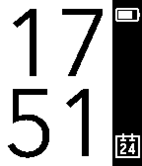

# SlimTimeFace
A stylish, modern watchface for the Pebble and Pebble Time watches. This is based on the code of [TimeStyle watchface](https://github.com/freakified/TimeStylePebble).

The main goal is to make it as lean as possible and to waste the least amount of battery as possible.

## What gives feature XYZ is missing!
Sorry this is supposed to be a non configurable watch face without any extra frills. What you see is what you get.

## Want to try it?
You must sideload it, since it is not on the Pebble store. A build is available on the releases page. You can also use Gadgetbridge to install it.
